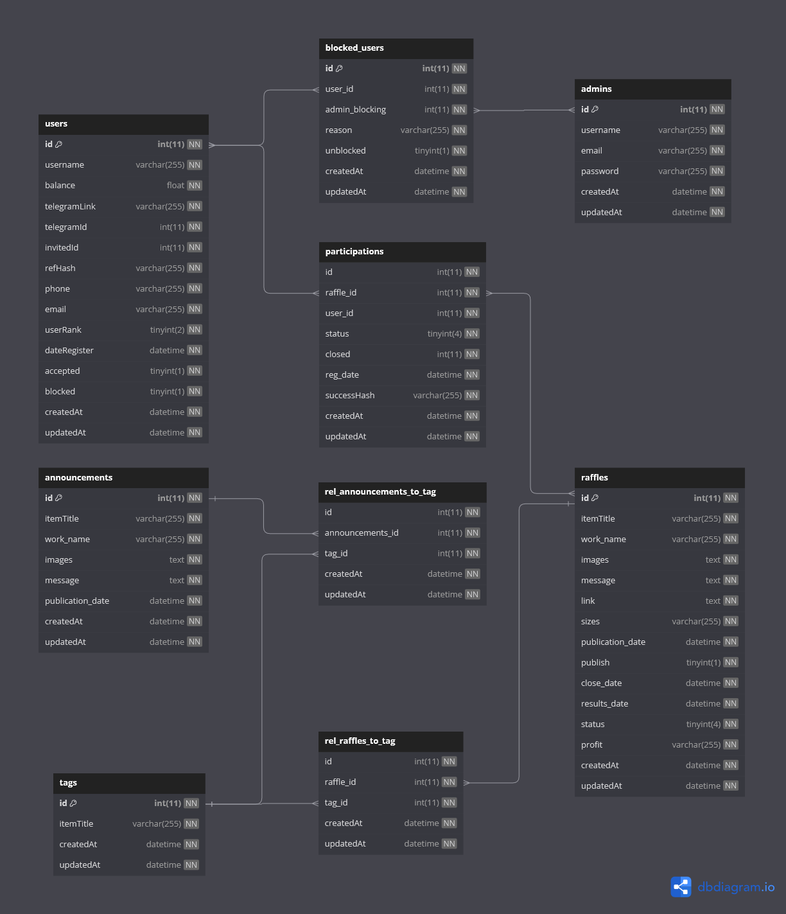

# YardBot API

> Created by Ivan Ilichev | 05.12.2023 | TTC8430-3003

## Overview

[YardBot](https://github.com/steezydev/YardRafflesBot) is a telegram bot and part of **YardRaffles** project. This is an API backend solution - a core of the YardRaffles project.

Rare clothing items, particularly sneakers, are frequently sold in limited quantities, making their purchase challenging. To address this, major brands and their retailers conduct raffles granting the "right to purchase" these exclusive fashion pieces, simultaneously boosting their social media following.

This project focuses on such raffles. Its primary objective is to facilitate genuine enthusiasts, rather than resellers, in acquiring these items through luck, without the intent of profit-making.

### Time spent

YardBot was a project that was initially intended to go into production, so the total time spent including research, negotiations and planning would be `2 months`. _Unfortunately, it was never finished..._

However, total time spent on development could be summarized into `2 weeks` of total work

### Self-assessment

I think I did a great job cultivating and implementing my initial idea. This project includes most of the knowledge from Web server programming course and suites the grading criteria for the project assignment. I think it can be assessed with the highest grade.

I have successfully implemented:

- Database structure - database structure allow almost complete functionality of the app as planned initially
- API endpoints - existing endpoints allow almost complete functionality of the app as planned initially
- API documentation - API is very well documented with Swagger
- Request validation - all request data is being validated

I might have done better:

- Error handling - error handling code could be optimize to avoid repeating patterns
- DB field names - inconsistent naming and case
- Images - images are currently handled as link to external sources
- Status field - right now status is handled with a number and doesn't have a separate model
- Using Sequelize - it was a big mistake...

## Structure

### App

- `controllers` - calling services and handling errors
- `middleware` - auth middleware for protected routes
- `migrations` - data structure migrations used to initialize the db
- `models` - data models declared with `Sequelize`
- `routes` - api endpoints
- `services` - performing data querying and mutation using `Sequelize`
- `validation` - validating request data with `express-validator`

### Database

DB dump can be found [here](/database.sql)



### API

- API documentation can be found [here](https://app.swaggerhub.com/apis-docs/Nuko/YardRaffleBot/1.2.0-eng#/)
- API schema can be found [here](https://app.swaggerhub.com/apis/Nuko/YardRaffleBot/1.2.0-eng)

## Getting started

### Install dependencies

```sh
npm install
```

### Run migrations

```sh
npx sequelize-cli db:migrate
```

or import [`database.sql`](/database.sql) straight

### Set env variables

Example:

```sh
DB_HOST="127.0.0.1"
DB_USER="root"
DB_PASSWORD=""
DB_NAME="yardraffles"
PORT=3000
AUTH_SECRET="123"
```

### Run app

```sh
yarn dev
```
